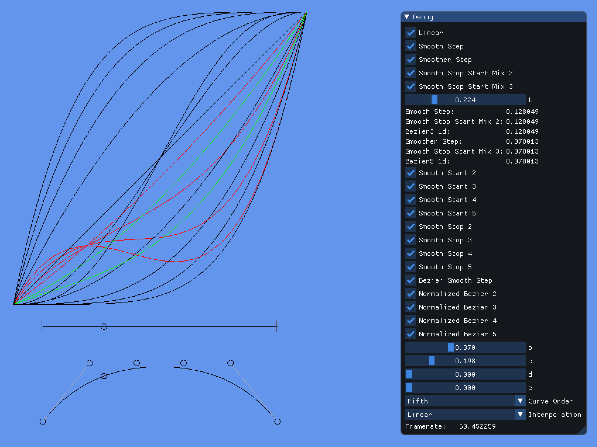

# sdl-bgfx-imgui-as - 1d-nonlinear-transformations

This repo is spawned from [sdl-bgfx-imgui-starter](https://github.com/pr0g/sdl-bgfx-imgui-starter) (please see the original repo for full details on project setup).

`sdl-bgfx-imgui-as_1d-nonlinear-transformations` is inspired by [Math for Game Programmers: Fast and Funky 1D Nonlinear Transformations](https://youtu.be/mr5xkf6zSzk). A talk by [Squirrel Eiserloh](https://twitter.com/SquirrelTweets).

Also checkout [this](https://twitter.com/SquirrelTweets/status/1309755895941865472) Twitter thread for more fascinating details on how these curves can be derived.
